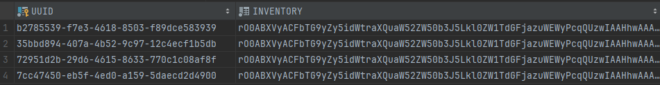

# How does it work?

When you open a shulker for the first time, AxShulkers puts a UUID on it:

<i>* output from /paper dumpitem</i>

The plugin stores everything in a database, and it finds the items based off the shulker's UUID

So instead of storing the items within the shulker item's nbt, the plugin stores them in a database.
When a player first opens a shulker, it creates a database entry and after that it will load it into memory as a inventory.
Because of this the only way to dupe items is to find a dupe in the vanilla minecraft inventories.

However there is a big disadvantage, which is if you copy paste a shulker or duplicate them, they will share the same inventory, which is usually not what people want.
To prevent shared inventories, you must clear the UUID from shulkers with <b>/axshulkers clear</b> to be able to use them in crates or kits.
